# Installation de R, RStudio et Jupyter Notebooks

Pour ce cours, nous utilisons les logiciels suivants:

- Excel ou OpenOffice Calc
- Un éditeur de texte, p.ex. Notebook++ (Windows) ou TextWrangler resp. BBEdit (macOS)
- [R](https://www.r-project.org/) et [RStudio Desktop](https://www.rstudio.com/products/rstudio/)
- Jupyter Notebooks (avec [Nteract](https://nteract.io/) ou dans le navigateur Web)

En principe, pour suivre le cours, vous n'avez pas besoin d'installer quoi que ce soit. Dans ce cas, vous avez 2 possibilités:

- utiliser les ordinateurs dans les salles Amphipôle 140 et 146, où tout est déjà installé.
- utiliser les Juypter Notebooks sur [Azure](https://notebooks.azure.com/).

Si vous préférez tout de même d'installer les logiciels sur votre ordinateurs, vous pouvez simplement suivre les instructions ci-dessous, selon votre système d'exploitation.

Si vous appartenez à la catégorie de personnes qui refusent d'installer Jupyter Notebooks pour des raisons de santé (votre propre santé ou celle des autres), vous pouvez aussi utiliser les notebooks dans RStudio et ne pas installer Jupyter et compagnie. Les points 1 et 2 ci-dessous restent identiques.

## MacOS

_Installer **dans l'ordre :**_

**1. R**

Via https://stat.ethz.ch/CRAN/ sélectionnez la version de R à télécharger en fonction de votre système d’exploitation (Mac, Windows, Linux).
- Pour les utilisateurs Windows : Cliquez sur *« base »* puis téléchargez *« Download R 3.4.1 for Windows »*.
- Pour les utilisateurs Mac : Téléchargez uniquement le fichier .pkg correspondant à votre version (pas besoin d’installer XQuartz).
Si l’ordinateur bloque l’ouverture du fichier, allez sous préférences système > sécurité et confidentialité > ouvrir quand même.

**2. RStudio**

Sur https://www.rstudio.com/products/rstudio/download/#download selectionnez la version gratuite Desktop (première colonne à gauche) puis au bas de la page sous *« Installers for Supported Platforms »* choisissez le lien correspondant à votre système d’exploitation.

**3. Jupyter Notebooks**

A installer via Anaconda (https://www.continuum.io/downloads). Téléchargez la version Python 3.6 (pas obligatoire, 2.7 va bien aussi).

**4. R kernel pour Jupyter**

Sur https://irkernel.github.io/ suivre les instructions sous l’onglet *« installation »* :
- Windows : idem que pour mac ci-dessous, sauf que la partie dans Terminal se fait toujours sur R.
- OSx :
  - Ouvrez R, copier-coller la première ligne *« install.packages…»* dans la console R puis faites enter pour exécuter la commande. Une nouvelle fenêtre *« Secure CRAN mirrors »* s’ouvre dans laquelle il faut sélectionner *« Switzerland »*.
  - Idem avec la deuxième ligne *« devtools::… »*. Si l’ordinateur le demande, installez Xcode puis relancez la ligne *« devtools::… »*.
  - Ouvrez **Terminal**. Tapez R puis enter. Ensuite copier-coller la ligne *« IRkernel::… »*.
  - Vous devriez obtenir *« [InstallKernelSpec] Installed kernelspec ir in /Users/yourusername/Library/Jupyter/kernels/ir »* si l’installation a réussi.

**5. Nteract**

Sur https://nteract.io sélectionnez le lien correspondant à votre système d’exploitation, (téléchargez soit le fichier *« installer »*, soit le *« zip »*).

## Windows

Si vous n'avez pas retouché _R_ depuis un certain moment (> 4 mois), vous pouvez commencer par désinstaller _R_ et _RStudio_ de votre machine afin de limiter les éventuels problèmes de packages (Sous Windows : _Paramètres_ > _Applications_ > Chercher et désinstaller R for Windows et RStudio).

Ensuite avec un environnement propre, vous pouvez installer **dans l'ordre** les éléments suivants :

**1. R**

Il faut aller télécharger la dernière version de R qui est disponible sur [CRAN](https://stat.ethz.ch/CRAN/) > _Download R for Windows_ > _Install R for the first time_.

Quand vous lancez l'installation 2 étapes sont importantes :

Il faut se rappeller dans quel dossier vous faites l'installation, **nous en aurons besoin plus tard**.

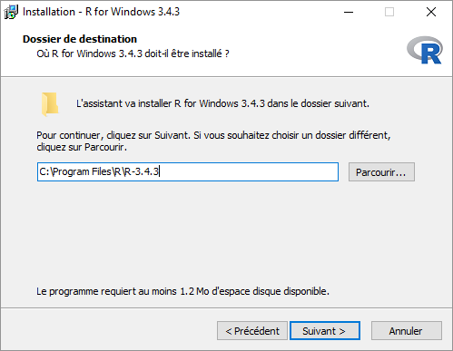

Ensuite, il faut aller dans les _Informations système_ pour regarder quel est le _type_ de votre système (32-bit/x32 ou 64-bit/x64). Ensuite vous pouvez décocher la case qui ne correspond pas à votre système

Pour le reste, vous pouvez laisser les options par défaut.

Une fois l'installation terminée, il faut aller ajouter le programme au _Path_, afin de pouvoir l'utiliser depuis la ligne de commande (ça peut faire peur, mais ce n'est pas (si) compliqué !).

Pour modifier le _Path_, il faut aller dans les variables d'environnement

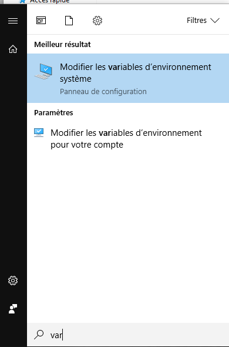

Puis cliquer sur _Variables d'environnement_

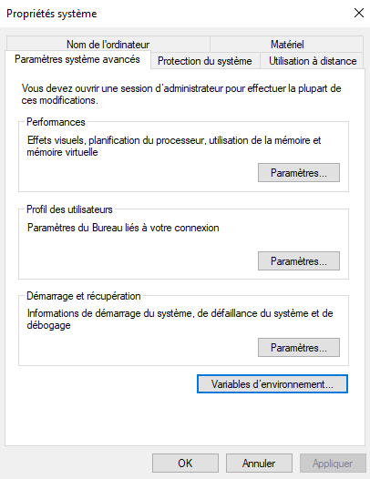

Ensuite, il faut double-cliquer sur _Path_ et après le menu de modification s'ouvre
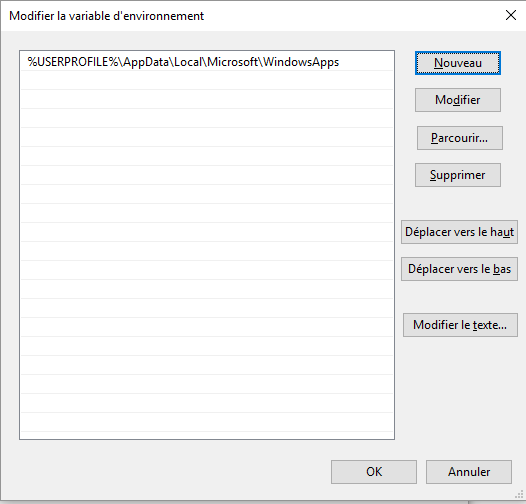

Cliquez sur _Nouveau_ et ajoutez le chemin d'accès à _R.exe_. Ce chemin correspond à celui où _R_ a été installé et il faut encore aller dans le dossier _bin_. Dans le cas d'une installation standard, le chemin d'accès est le suivant : **`C:\Program Files\R\R-3.4.3\bin`**. Vous pouvez copier le chemin depuis l'explorateur

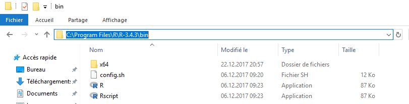

et le coller dans le _Path_.

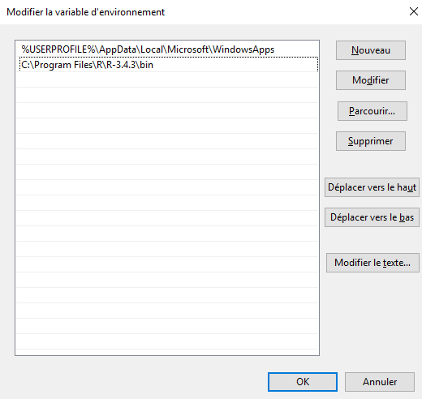

Une fois que c'est fait, vous pouvez appuyer sur _OK_ pour les différentes fenêtres.

Pour vérifier que cela a fonctionné, ouvrez une _Invite de commande_ (recherchez la, puis cliquez dessus), tapez _R_ puis faites _Enter_ et R devrait se lancer!

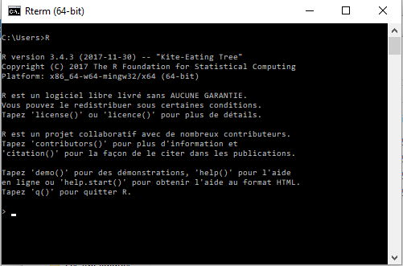

Si c'est le cas, fermez l'invite de commande et passez à l'étape suivante.

**2. RStudio**

Sur [le site de RStudio](https://www.rstudio.com/products/rstudio/download/#download), au bas de la page de téléchargement, sous _Installers for Supported Platforms_ choisissez le lien correspondant à votre système d’exploitation.

Ensuite, il suffit de lancer l'installeur et de laisser les options par défaut. Une fois installé, passez à l'étape suivante.

**3. Jupyter Notebooks**

Pour pouvoir utiliser les notebooks, il faut télécharger [Anaconda](https://www.anaconda.com/download/). Préférez la version Python 3.6.

Lors de l'installation, une option **qu'il faut cocher** est celle dans les _Advanced Options_ : _Add Anaconda to my Path environment variable_. Cela nous évite de devoir répéter la même procédure que pour _R_.

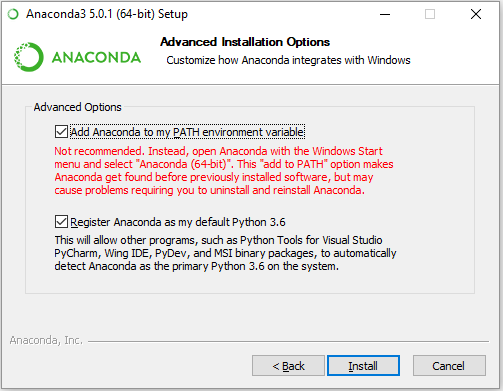

 (L'installation est un peu longue, vous pouvez télécharger (sans installer) [Nteract](https://nteract.io/) et [Git](https://git-scm.com/download/win) pendant ce temps).

Quand l'installation est terminée, vous poouvez décocher les deux options et terminer l'installeur.

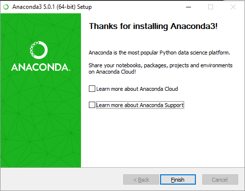

Ensuite, il faut à nouveau ouvrir une invite de commande et exécuter la commande suivante: **`conda update notebook`** . Cela vous assurera d'avoir la version la plus récente des notebooks. Quand la commande vous demande `Proceed ([y]/n)?`, vous pouvez simplement appuyer sur _Enter_ pour continuer.

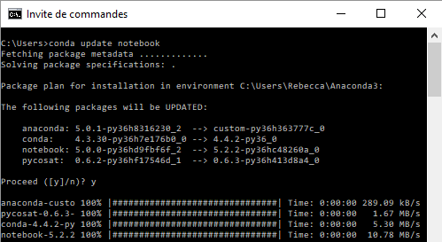

Si ça fonctionne passez à l'étape suivante. S'il le _package_ notebok est déjà à jour, faites pareil.

Par contre, s'il y a une erreur du type `conda n'est pas reconnu en tant que...`, c'est que vous avez oublié de cocher l'option lors de l'installation et il faut donc aller ajouter _Anaconda_ au _Path_ ou, plus simple, désinstaller et réinstaller Anaconda.

**4. R kernel pour Jupyter**

Les instructions d'installation ci-dessous proviennent du [site de IRkernel](https://irkernel.github.io/installation/). Cette installation permet d'utiliser _R_ dans les notebooks.

1. Ouvrez une nouvelle invite de commande et lancez _R_

2. Exécutez la commande suivante toujours dans _R_: **`install.packages(c('repr', 'IRdisplay', 'evaluate', 'crayon', 'pbdZMQ', 'devtools', 'uuid', 'digest'))`** . Il est possible que _R_ vous demande depuis quel serveur il doit les installer, choisissez alors le répertoire suisse de l'EPFZ.

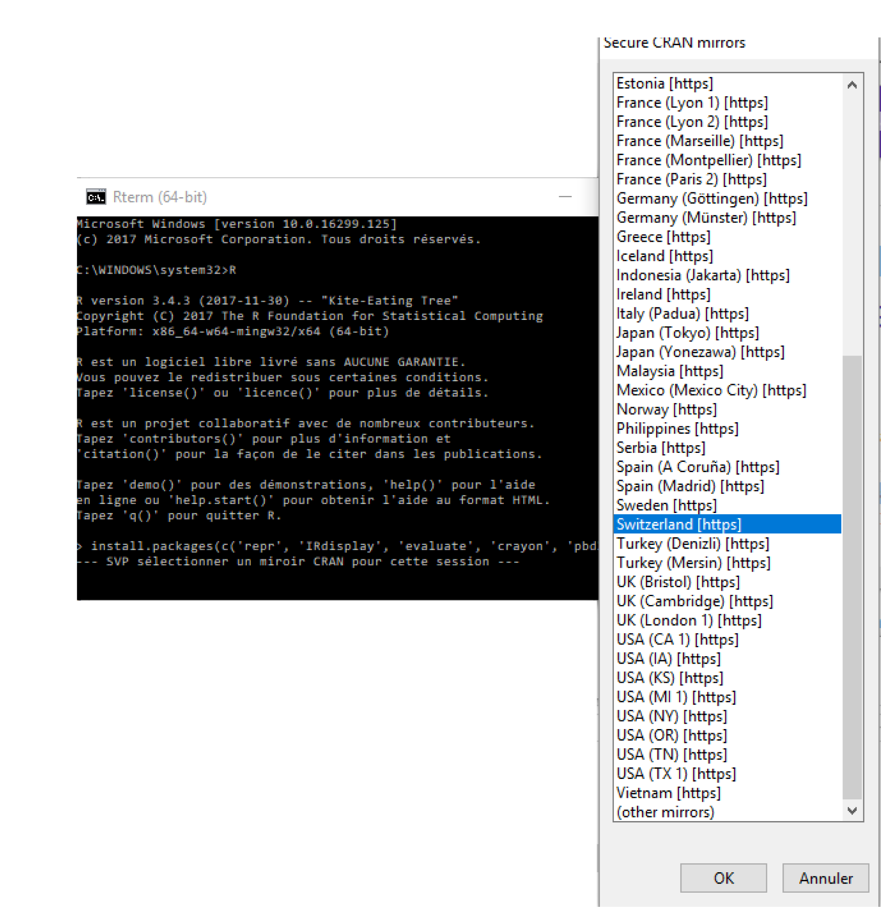

*NB* Si R ne vous laisse pas écrire dans la librairie, vous pouvez repartir de l'étape 1 en lançant cette fois l'invite de commande en mode administrateur (clic droit sur l'IC et ensuite choisir _Exécuter en tant qu'administrateur_).

3. Une fois que tout est installé, exécutez la ligne suivante: **`devtools::install_github('IRkernel/IRkernel')`** (Si la commande sort un _warning_, rien à craindre cela a sans doute fonctionné)

4. Finalement exécutez la commande suivante: **`IRkernel::installspec()`** . Si ça a fonctionné, il devrait y avoir un message du type _Installed kernelspec ir in..._. Dans ce cas, passez à l'étape suivante.

**5. Nteract**

Sur le site d'[Nteract](https://nteract.io), téléchargez l'installeur et ensuite éxécutez le.

**6. Git**

Ici [Git est le système de gestion de version](https://git-scm.com/), à ne pas confondre avec GitHub, hébergeur de projets.

[Téléchargez l'installeur](https://git-scm.com/download/win) et lancez-le. Il y a deux options pour lesquelles il faut faire particulièrement attention.

Décochez les éléments inutiles dans la sélection des composantes:

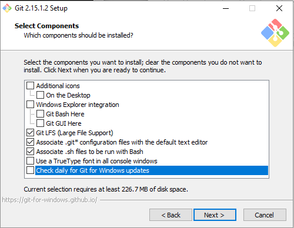

Assurez-vous que Git soit ajouté au _Path_:

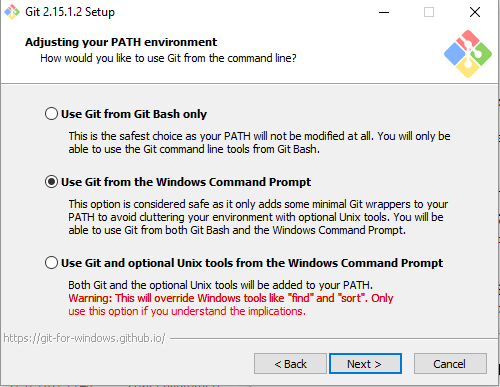

Finalement, vous pouvez décocher les options proposées avant d'appuyer sur terminer:

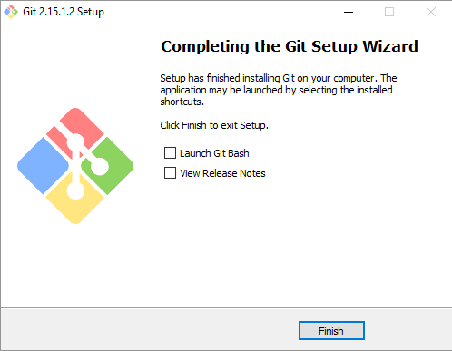

#### Conclusion

Si tout s'est bien passé, ta machine devrait être prête à te permettre d'utiliser les notebooks, que se soit dans jupyter ou avec Nteract.

Pour la suite, n'oublie pas de jeter un oeil à la description de l'environnement de travail pour éclaircir tout ce que tu viens d'installer et surtout **au tutoriel terminal_inviteCmd** pour te faire la main sur l'utilisation de la ligne de commande et des notebooks et préparer un environnement de travail efficace.
