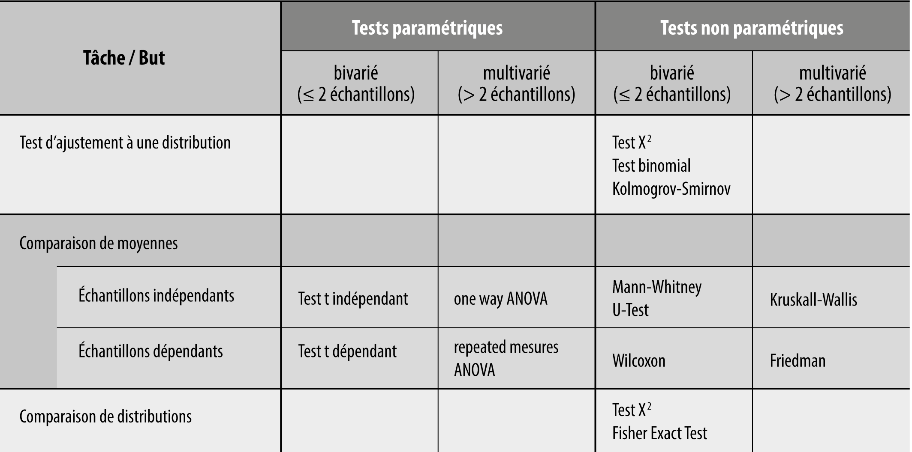

# Tests statistiques

Les tests statistiques permettent d'évaluer des hypothèses très précises par rapport à nos données. Différents tests existent dans des buts très spécifiques. 

Ici, nous montrons quelques-uns des tests les plus utilisés, ensemble avec des exemples pratiques.

Voici un aperçu de différents tests, en fonction de leur utilisation:

Les tests avec des exemples pratiques sont montrés dans le notebook [tests-statistiques.ipynb](tests-statistiques.ipynb).

L'exercice par rapport aux tests est décrit dans le fichier [exercice-tests-statistiques.md](exercice-tests-statistiques.md).

