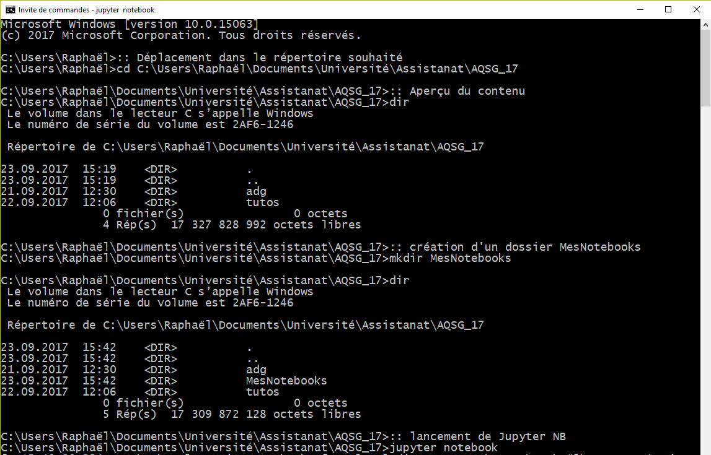

# Quelques commandes du terminal / invite de commandes qui peuvent servir

Le Terminal (_OSx_, _Linux_) ou l'invite de commande (_Windows_) est le lieu où il est possible d'entrer des commandes qui permettent d'exécuter différentes actions sans recourir à l'interface graphique et de façon plus rapide et efficace.

Ce document est divisé en deux parties car le système d'exploitation de Windows ne repose pas sur la même base (UNIX) que Linux et Mac. Il y a donc quelques subtilités et différences dans les commandes.

## Le Terminal de Mac

Lorem ipsum dolor sit amet, consectetur adipisicing elit, sed do eiusmod tempor incididunt ut labore et dolore magna aliqua. Ut enim ad minim veniam, quis nostrud exercitation ullamco laboris nisi ut aliquip ex ea commodo consequat. Duis aute irure dolor in reprehenderit in voluptate velit esse cillum dolore eu fugiat nulla pariatur. Excepteur sint occaecat cupidatat non proident, sunt in culpa qui officia deserunt mollit anim id est laborum.

## L'invite de commandes Windows

Il existe plusieurs façons d'accéder à l'invite de commande (IC). Il est possible de taper _Invite de commandes_ dans la recherche Windows et de cliquer dessus. Il est également possible d'utiliser le raccourci __`Win`__ + __`R`__ et d'ouvrir __`cmd`__.

Une fois lancé, voici à quoi ressemble l'IC. Vous arrivez dans votre dossier utilisateur, ce que la console vous indique __`C:\Users\nomUtilisateur>`__. Ce qui ce trouve avant le __`>`__ est le répertoire actuel, ce qui se trouve après est la commande à exécuter.

#### Commandes utiles

Il existe une multitude de commandes possibles et de nombreuses autres que vous pouvez ajouter au fur et à mesure que vous installez des programmes sur votre ordinateur.

##### cd
Cette commande sert à naviguer dans l'arborescence de vos dossiers et documents. __`cd`__ signifie _change directory_.
On peut l'utiliser de différentes façons :

- Naviguer pas à pas dans les dossiers, en utilisant __`cd nomDossier`__

  

- Aller directement dans le dossier cible, avec __`cd chemindAccesAuDossier`__

  

  _NB_ Il est possible de copier le chemin d'accès dans la barre en haut de l'explorateur de fichiers
  

- Naviguer de façon relative (comme pour charger un fichier dans _R_, par ex.), où __`cd ..`__ permet de sortir du dossier actuel

  

On ne se rappelle pas tous exactement de comment sont organisés nos dossiers, de quel est le prochain niveau dans l'arborescence, etc. Il y a donc 2 façons de s'en sortir un peu plus vite quand on navigue avec __`cd`__.
- Après avoir écrit __`cd`__, si on fait un espace et utilise _Tab_, il est possible de passer l'entier du dossier en revue. De même, si on commence à écrire, par exemple, __`cd doc`__, avec _Tab_ il est possible d'auto-compléter avec les dossiers qui commencent par _doc_ (affiche directement le bon, s'il n'y en a qu'un). Dans ce cas __`cd doc`__ puis _Tab_ se complète en __`cd Documents`__.

- La commande __`dir`__

##### dir
Cette commande permet d'obtenir un aperçu des dossiers et documents présents dans le répertoire (_directory_) actuel. On obtient également les informations sur la dernière modification, si c'est un dossier (__`<DIR>`__) ou non, la taille des fichiers (en octets) et si c'est un fichier/dossier caché (le nom commence par un point).

#### Exemple pratique avec les notebooks

Il est pratique d'ouvrir les notebooks depuis un répertoire qui contient d'une part le dossier _adg_ (téléchargeable depuis [GitHub](https://github.com/christiankaiser/adg)) et d'autre un dossier avec vos propres notebooks. Ainsi, vous n'aurez qu'à télécharger et remplacer chaque semaine le dossier de cours actualisé, tout en pouvant conserver vos propres projets et notes dans l'autre dossier.

Dans l'exemple qui suit, les différentes étapes permettent d'accéder à ce résultat:
1. Aller dans le dossier (__`cd chemindAccesAuDossier`__) contenant le dossier _adg_
2. Création d'un nouveau dossier (__`mkdir nomDossier`__)
3. Vérification du contenu du répertoire (__`dir`__), avec au moins le dossier _adg_ et le nouveau dossier créé.
4. Lancement du serveur de notebooks (__`jupyter notebook`__) ([A condition d'avoir fait les 4 premiers points des installations](https://github.com/christiankaiser/adg/tree/master/11-installation-r-etc))

Ce qui entraîne l'ouverture automatique dans le navigateur internet

A partir de là, vous pouvez, par exemple, ouvrir dans un onglet le dossier _adg_ et ses différents notebooks et dans un autre onglet votre dossier pour éditer vos notebooks en parallèle.

Pour quitter le serveur (**après avoir sauvegardé vos notebooks**), il suffit de retourner dans l'IC où il "tourne" et d'effectuer __`Ctrl`__ + __`C`__ deux fois.

#### Remarques
Il est possible de naviguer dans les commandes déjà exécutées, à l'aide des touches __`↑`__ et __`↓`__. Il est possible d'afficher caractère par caractère la dernière commande avec __`→`__.

Dans la mesure du possible, **évitez les accents et espaces** dans vos noms de dossiers et fichiers, ceux-ci peuvent poser problèmes à certains logiciels dont l'encodage est différent. Vous risquez de vous retrouver avec des problèmes d'installations et/ou des fichiers corrompus (_NB_ par expérience, les accents dans le nom d'utilisateur sont à proscrire !)

Un des défauts notables, relativement aux Macs, c'est qu'il faut ajouter manuellement le chemin d'accès à certains programme dans le _PATH_ pour utiliser la commande. Il n'est donc pas possible de simplement taper __`R`__ dans l'IC après l'avoir installé. Ce n'est pas si compliqué, demandez si vous êtes intéressés.

##### Autres commandes

- __`cd\`__ : retour à la racine du disque

- __`start .`__ : ouvre l'explorateur de fichiers au répertoire courant

- __`mkdir nomDossier`__ : crée un dossier de ce nom dans le répertoire courant

- __`ren x y`__ : renomme le fichier x en y

- __`exit`__ : quitte l'invite de commandes

- __`atom`__ : si Atom est installé, l'ouvre au répertoire courant

- __`color 0a`__ : pour un style _Matrix_

- __`color 07`__ : fond noir (0), écriture blanche (7)
