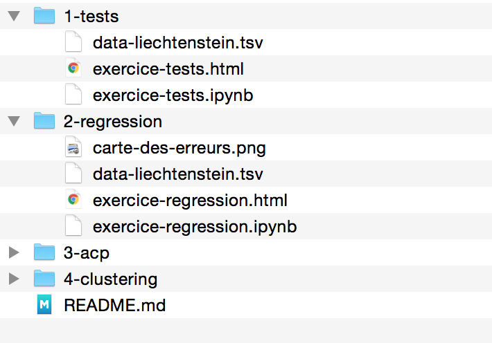

# Travail pratique ADG

Le but du travail pratique consiste à créer un dossier qui contient une description d'une série de méthodes statistiques, accompagnée des calculs et les interprétations.

Pratiquement, le dossier sera un ensemble de Jupyter notebooks ou de notebooks RStudio. Ces notebooks devront être rendus ensemble avec une version HTML (exportée depuis le notebook). Chaque notebook correspond à un des exercices présentés pendant le semestre dans le cours (voir plus bas pour les détails).

Voici la liste des exercices qui doivent être inclus dans le dossier (cette liste est complétée au fur et à mesure):

1. [Exercice sur les tests statistiques](../17-tests-statistiques/exercice-tests-statistiques.md)
2. [Exercice sur les régressions](../26-glm/4-exercice-regression.md)
3. [ACP](../30-acp) + [Clustering](../40-clustering)
4. Commentaire analyse statistique

## La région d'étude

Chaque personne aura une région d'étude différente. Les régions disponibles peuvent être trouvées dans le tableur Google à l'URL [http://bit.ly/2xwrQMF](http://bit.ly/2xwrQMF).

Pour vous inscrire pour une région d'étude particulière, il suffit de noter votre nom dans la colonne «Personne inscrite» dans le tableau des régions.

Il n'est pas possible de vous inscrire pour une région qui est déjà prise par quelqu'un d'autre.

## Les données

Les données pour le travail pratique sont disponibles dans le dossier [data](../data). Le maillage spatial est celui des régions Z05 de Suisse.

Chaque personne est responsable de faire l'extraction des données pour sa région d'étude. La délimitation peut être faite avec QGIS en utilisant le fichier Shape dans [data/shp](../data/shp).

## Préparer le rendu

Vous devez rendre un dossier avec la structure suivante:

Voici les points importants:

- Chaque exercice doit être dans un dossier à part, avec les exercices numérotés dans l'ordre
- Votre dossier de TP doit avoir un fichier README.md qui contient au minimum votre nom, prénom et votre adresse e-mail.
- Pour chaque exercice:
	- le dossier de l'exercice doit contenir l'ensemble des fichiers nécessaires pour faire tourner votre Jupyter Notebook
	- le dossier de l'exercice doit également contenir l'ensemble des images que vous avez inséré dans le Notebook
	- évidemment le Notebook (Jupyter ou RStudio) de l'exercice!
	- et un export HTML du Notebook (dans Jupyter, menu File > Download As... > HTML

Si vous avez tous les 4 exercices, et vous remplissez les critères ci-dessus, vous pouvez soumettre votre dossier du TP sous forme de fichier ZIP. 

La soumission se fait par e-mail à l'adresse [gse.cartosig+adg18@gmail.com](mailto:gse.cartosig+adg18@gmail.com). **Merci d'utiliser uniquement votre adresse UNIL pour l'envoi de la soumission!**

**Le délai de rendu est fixé au 20.12.2017.** À partir du 21.01.2018, une pénalité de retard d'une demie note par jour est appliquée.